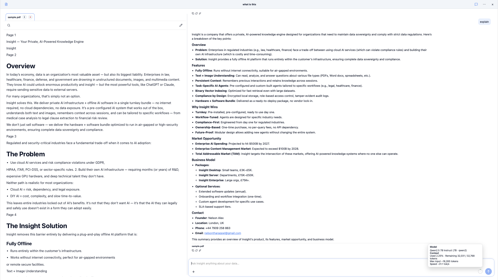
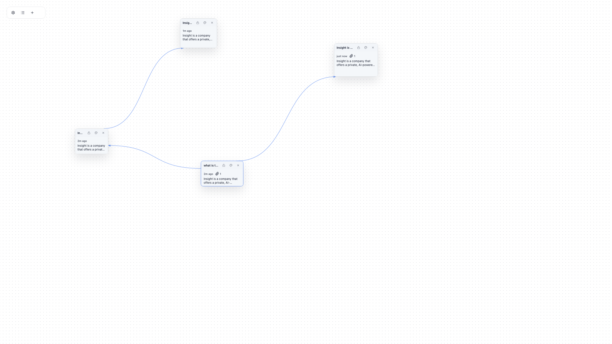

# Insight — Private, Local AI Workspace for Document Intelligence

**Insight** is a local-first desktop workspace for turning your files (PDFs, notes, logs) into **cited answers and reusable artifacts**, powered by **your own model** and **without sending anything to the cloud**.

- **Bring your own LLM**: model-agnostic local inference (GGUF or localhost Raw API)
- **Drop in files, get cited answers**: focused vs all-docs scope, compare mode, selection-first follow-ups
- **Canvas-style workspace**: chats, documents, and outputs side-by-side
- **Artifacts, not just chat**: summaries, extracted tables, comparisons, drafts
- **Private + fast**: runs fully offline with streaming + per-chat KV snapshot resume (no prompt replay)

> **Status:** Beta. Stable on **macOS (Apple Silicon)**.

## Demo

<p align="center">
  
</p>
<p align="center"><b>Compare & explain across two documents with scope control</b></p>

<br/>

<p align="center">
  
</p>
<p align="center"><b>Canvas workspace with linked cards</b></p>

<br/>

<p align="center">
  
</p>
<p align="center"><b>Settings: local Raw API server running on localhost</b></p>

## Who This Is For

Insight is for people who need **private, explainable answers over local documents**, such as:

- Researchers / students working across many PDFs and notes
- Consultants / analysts doing cross-document synthesis
- Regulated teams that cannot upload documents to cloud AI
- Developers who want local RAG + a localhost inference API

## 60-Second Walkthrough

1. Create a workspace card
2. Drop files (PDF/text/logs) into the doc pane
3. Wait for ingestion to finish (embedding + indexing)
4. Ask focused or cross-doc questions
5. Switch scope between **Focused** and **All docs**
6. Branch work on new cards without mixing context

## What Makes Insight Different

- Model-agnostic local inference (bring your own LLM)
- Scope is first-class (focused doc vs all docs)
- Cited, document-grounded answers with ephemeral evidence injection (clean history/KV)
- RAG-ready gating prevents answering before ingestion completes
- Large-file fallback for logs/text via ripgrep windows
- Dual access: desktop IPC (full RAG) + localhost HTTP raw engine
- Artifact-first outputs (summaries, tables, comparisons, drafts)

## Engineering Highlights

- KV snapshotting for fast chat resume without prompt replay
- Dual interface architecture: desktop IPC + localhost HTTP raw engine
- Hybrid retrieval: dense vectors + lexical fallback + raw-large mode
- Context hygiene: ephemeral CONTEXT PACK and ingestion gating
- Artifact contract + effective runtime contract snapshots for reproducibility

## Documentation

- [Docs index](docs/INDEX.md)
- [Architecture deep dive](docs/ARCHITECTURE.md)
- [Technical decisions](docs/DECISIONS.md)
- [MLOps guide](docs/MLOPS.md)
- [Raw engine API](docs/RAW_ENGINE_API.md)
- [Onedir build guide](docs/ONEDIR_BUILD_GUIDE.md)
- [Fresh machine checklist](docs/FRESH_MACHINE_CHECKLIST.md)

## Repo Layout

- `insight/` — Tauri + React desktop app
- `backend/` — FastAPI IPC engine, retrieval + llama.cpp orchestration
- `configs/` — artifact contract (`app.yaml`, `models.yaml`, profiles)
- `scripts/mlops/` — validation/export/checksum automation scripts
- `eval/` — lightweight RAG eval harness dataset + runner

## Quick Start

### Production Build (macOS Onedir)

```bash
./scripts/build_onedir_prod.sh
```

See [ONEDIR_BUILD_GUIDE.md](docs/ONEDIR_BUILD_GUIDE.md) for packaging and distribution details.

### Development Mode

```bash
# Frontend (React + Tauri)
cd insight
pnpm install
pnpm tauri dev

# Backend engine is spawned automatically by Tauri dev app.
# Optional custom interpreter:
# PYTHON_BIN=/path/to/python pnpm tauri dev
```

### First-Run Setup (Model + Embeddings)

On first launch, do this once per workspace:

1. Open **Settings → Model**
2. Set a GGUF path (example: `models/Qwen2.5-7B-Instruct_q4_0.gguf`)
3. Click **Apply**
4. Open **Settings → Embeddings**
5. Click **Download embeddings** (Nomic ONNX model + tokenizer)
6. Wait for status `ready`, then upload docs and chat

Embedding download location depends on workspace:

- Dev runs: `storage/em_models/nomic-embed-text/`
- Packaged app: `~/.insight/em_models/nomic-embed-text/`

If embeddings are missing, doc ingestion will not complete.

### Local HTTP API quick example

```bash
curl http://127.0.0.1:11435/v1/chat/completions \
  -H "Content-Type: application/json" \
  -d '{
    "messages": [{"role": "user", "content": "Hello!"}],
    "stream": false
  }'
```

## License

Licensed under the MIT License.

## Acknowledgments

- **llama.cpp**
- **Nomic AI**
- **Qdrant**
- **Tauri**
- **ripgrep**
- **FastAPI & uvicorn**
